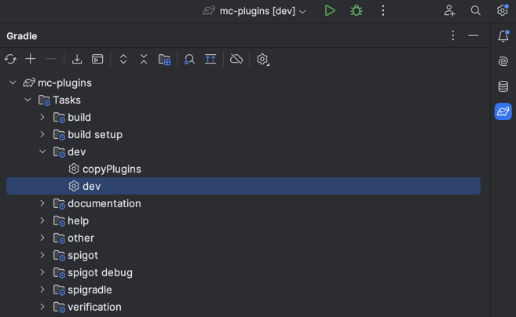

# mc-plugins

This is a set of Minecraft Spigot plugins, developed for fun usage in our survival world we play on with some friends.

## Contributing

This is a monorepo using Gradle submodules.
Each plugin is available in its own directory (starting with `plugin-`) and is developed, built and deployed separately.
A plugin can be implemented in Java (Kotlin might be supported later).

### Local Development

For local development, you will quite likely use the [dev-server](dev-server).
To start it, just run `./gradlew dev`.
The task will build all plugins, copy them to the plugin folder of the dev-server and spin it up.
If you use an IDE to start the task, you will also have the possibility to run in debug mode.
You can set breakpoints in your plugin code :)

Once the dev server is up and running, and you continue to implement your plugins, you might get to some point the plugins need the be refreshed on the server.
You now got two possibilities.
First of all, you could kill the running Gradle process and rerun the task using `./gradlew dev`.
Even though your IDE will be able to automate the restart, it is extremely slow.
You might want to consider not killing the dev-server and instead run `./gradlew copyPlugins` followed by the ingame command `/reload`.

### Release Workflow

To build and release, just merge or push to the main branch.
A GitHub Action will trigger and automatically create a tag and a release with bundled plugin `.jar` files of each plugin.
The released version number will be calculated based on conventional commits.
When no conventional commits are found, a release might not be created, so it is mandatory to use.
It also helps to maintain a readable changelog.
see: https://www.conventionalcommits.org
